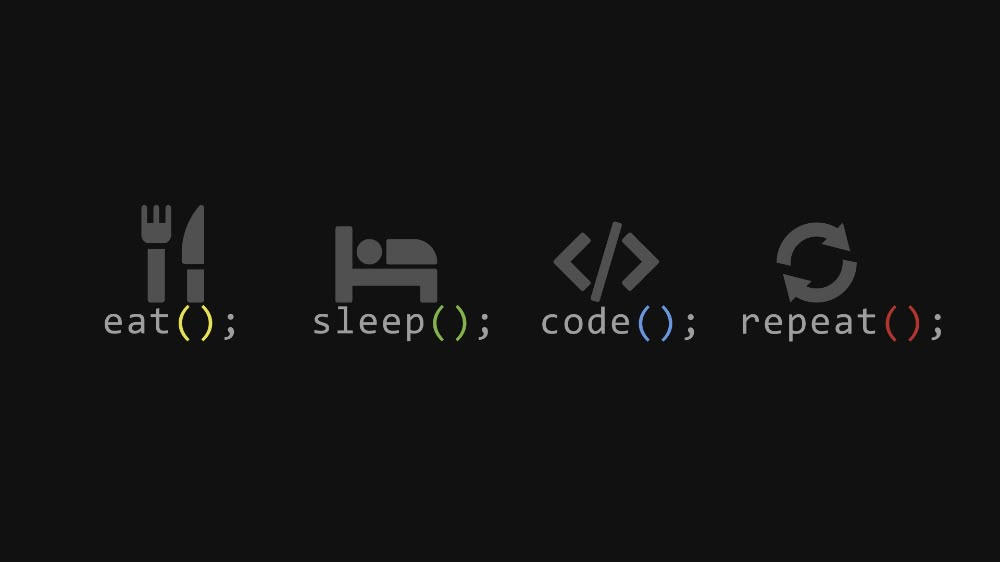

# Hello World! I`m Denis, an Ukrainian Web Developer ✌:

## 💫 About Me:

🌱 I'm currently studying  
👨‍💻 I'm Front-End developer  

# 💻 Tech Stack:

                       

# 📊 GitHub Stats:

 

  

## 🏆 GitHub Trophies

### ✍️ GitHub Snake

<picture>
  <source media="(prefers-color-scheme: dark)" srcset="https://raw.githubusercontent.com/tobiasmeyhoefer/tobiasmeyhoefer/output/github-snake-dark.svg" />
  <source media="(prefers-color-scheme: light)" srcset="https://raw.githubusercontent.com/tobiasmeyhoefer/tobiasmeyhoefer/output/github-snake.svg" />
  
</picture>

### ✍️ Random Dev Quote

---

###
